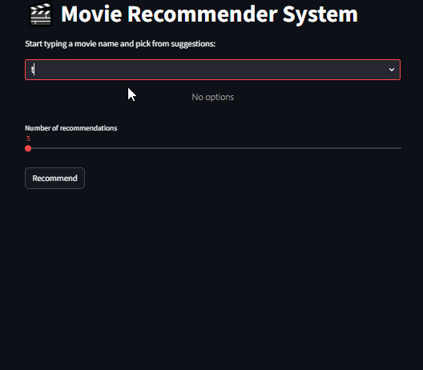

# 🎬 Content-Based Movie Recommendation System

A content-based movie recommendation system built on **41,917 movies** from the TMDB dataset. Uses **TF-IDF vectorization** and **cosine similarity** to find movies similar to what you love — with fuzzy title matching, weighted rating scoring, and a fully interactive Streamlit web app with live movie posters.

---

## 🚀 Live Demo

> 🔗 [Movie Recommender — Live App](https://content-based-movie-recommendation-system-ydmcw5ybnanz8q27cvnb.streamlit.app/)



---

## ✨ Key Features

- 🔍 **Fuzzy title search** — handles typos and partial movie names
- 🎯 **Multi-movie blended input** — combine two or more movies for mixed recommendations
- ⭐ **Weighted rating scoring** — prevents low-vote movies from dominating results
- 🖼️ **Live movie posters** — fetched in real time from the TMDB API
- 🎛️ **Adjustable results** — slider to choose 5–20 recommendations
- 📊 Built on **41,917 cleaned movies** from the TMDB Metadata Dataset

---

## 🗂️ Project Structure

```
content-based-movie-recommendation-system/
│
├── Data/
│   ├── Raw/
│   │   └── movies_metadata.csv          # Original TMDB dataset (45,466 movies)
│   └── processed/
│       └── cleaned_dataset.csv          # Cleaned & preprocessed (41,917 movies)
│
├── Models/
│   ├── tfidf_vectorizer.joblib          # Saved TF-IDF vectorizer
│   ├── tfidf_matrix.joblib              # Saved TF-IDF matrix (41,917 × 20,000)
│   └── movie_dataframe.joblib           # Saved movie dataframe with scores
│
├── Notebooks/
│   ├── 01_data_overview.ipynb           # Dataset exploration & quality analysis
│   ├── 02_data_cleaning.ipynb           # Cleaning, parsing & text preprocessing
│   ├── 03_recommendation_model.ipynb    # Model building, scoring & saving
│   └── 04_evaluation_model.ipynb        # Model testing & output validation
│
├── my_app/
│   ├── static/
│   │   └── demo.gif                     # App demo animation
│   ├── recommender.py                   # Core recommendation logic
│   └── streamlit_app.py                 # Streamlit web application
│
├── requirements.txt
└── README.md
```

---

## 📊 Dataset

| Property | Value |
|---|---|
| Source | [TMDB Movies Metadata Dataset](https://www.kaggle.com/datasets/rounakbanik/the-movies-dataset) |
| Original size | 45,466 movies × 24 columns |
| After cleaning | 41,917 movies × 6 columns |
| Features used | `overview` (plot) + `genres` combined |

---

## ⚙️ How It Works — Step by Step

### Step 1 — Data Overview (`01_data_overview.ipynb`)

Explored the raw TMDB dataset to understand structure and quality issues:

- **45,466 movies**, 24 columns
- **14,562 movies** with fewer than 5 votes (unreliable ratings)
- **1,258 movies** with suspiciously high ratings but almost no votes
- **954** missing overviews
- **1,158** duplicate overviews
- Genres stored as raw JSON strings — required parsing

---

### Step 2 — Data Cleaning (`02_data_cleaning.ipynb`)

- Dropped 19 irrelevant columns — kept only: `genres`, `original_title`, `overview`, `vote_average`, `vote_count`
- Filled missing overviews with empty string
- Parsed genres from JSON → plain text (e.g. `"Animation Comedy Family"`)
- Created `description` column = `overview` + `genres` combined
- Removed movies with fewer than 5 votes **and** rating ≥ 8 (noise / unreliable data)
- Removed duplicate titles
- Applied full text cleaning pipeline:
  - Lowercased all text
  - Removed special characters
  - Removed stopwords (NLTK)
  - Applied lemmatization (`WordNetLemmatizer`)
- Removed 237 rows with empty descriptions after cleaning
- **Final dataset: 41,917 movies**

---

### Step 3 — Recommendation Model (`03_recommendation_model.ipynb`)

#### TF-IDF Vectorization

Used `TfidfVectorizer` with:
- `max_features = 20,000`
- `ngram_range = (1, 3)` — captures single words, pairs, and triplets
- `stop_words = 'english'`

Result: **41,917 × 20,000 TF-IDF matrix**

#### Weighted Rating Score

To rank results fairly (not just by raw vote count):

```
score = (v / (v + m) × R) + (m / (m + v) × C)
```

| Variable | Meaning |
|---|---|
| `v` | Movie's vote count |
| `m` | Minimum votes threshold (75th percentile) |
| `R` | Movie's average rating |
| `C` | Overall mean rating across all movies |

This prevents a movie with 1 vote and 10/10 from outranking a movie with 5,000 votes and 7.7/10.

#### Cosine Similarity + Fuzzy Matching

- Calculates similarity between movies using **cosine similarity** on TF-IDF vectors
- Supports **multiple input movies** — averages their similarity scores for blended results
- Uses `thefuzz` library for fuzzy title matching (handles typos)
- Accepts match if confidence score > 60%

#### Example Output

Input: `"toy sto"` → Matched to: `"toy story 2"`

| Title | Rating | Votes | Score |
|---|---|---|---|
| Toy Story | ⭐ 7.7 | 5415 | 7.69 |
| Toy Story 3 | ⭐ 7.6 | 4710 | 7.58 |
| Toy Story of Terror! | ⭐ 7.3 | 246 | 7.08 |

---

### Step 4 — Streamlit Web App (`my_app/streamlit_app.py`)

An interactive web application with:

- **Live searchbox** — autocomplete as you type
- **Fuzzy matching** — works even with typos and partial names
- **Adjustable results** — slider to choose 5–20 recommendations
- **Movie posters** — fetched live from the TMDB API
- **Grid layout** — 5-column display with rating shown below each poster

---

## 🛠️ Tools & Libraries

| Category | Tools |
|---|---|
| Language | Python 3.11 |
| Data manipulation | Pandas, NumPy |
| NLP & ML | Scikit-learn (TF-IDF, Cosine Similarity), NLTK |
| Fuzzy matching | thefuzz |
| Web app | Streamlit, streamlit-searchbox |
| Movie posters | TMDB API |
| Model saving | Joblib |
| Visualization | Matplotlib, Seaborn, Plotly |
| Environment | Jupyter Notebook |

---

## 🚀 How to Run Locally

```bash
# 1. Clone the repository
git clone https://github.com/Md-Maruf-1727/content-based-movie-recommendation-system.git
cd content-based-movie-recommendation-system

# 2. Install dependencies
pip install -r requirements.txt

# 3. Download NLTK data (first time only)
python -c "import nltk; nltk.download('stopwords'); nltk.download('wordnet')"

# 4. Run notebooks in order to generate model files
# Open and run: 01 → 02 → 03

# 5. Launch the Streamlit app
cd my_app
streamlit run streamlit_app.py
```

---

## 📈 Model Evaluation (`04_evaluation_model.ipynb`)

The final model was validated with multiple test queries including typo inputs and multi-movie blended requests. Results confirmed that:

- Fuzzy matching correctly resolves partial and misspelled titles (threshold > 60%)
- Weighted scoring consistently surfaces well-rated, high-vote movies at the top
- Multi-movie input successfully averages similarity vectors for blended genre results

---

## 👤 Author

**Md. Maruf**
GitHub: [github.com/Md-Maruf-1727](https://github.com/Md-Maruf-1727)
